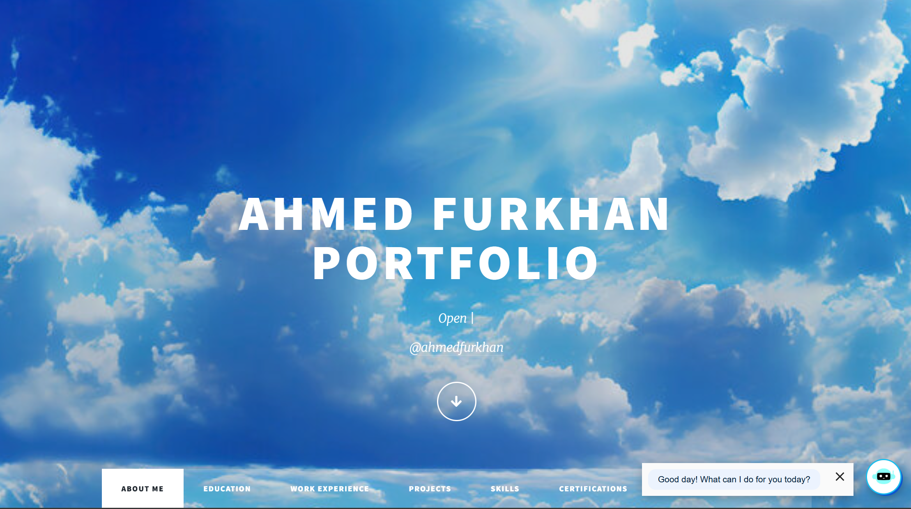

# Ahmed Furkhan — Personal Portfolio

## Author

**Ahmed Furkhan**  
MS Computer Science · Northeastern University (Khoury College)  
📧 [ahmedfurkhan98@gmail.com](mailto:ahmedfurkhan98@gmail.com)  
🔗 [linkedin.com/in/ahmedfurkhan](https://www.linkedin.com/in/ahmedfurkhan)  

---

## Class Link

**CS 5610 — Web Development**  
Khoury College of Computer Sciences, Northeastern University  
[Course Page](https://johnguerra.co/classes/webDevelopment_fall_2024/)

---

## Project Objective

Build a personal homepage using **vanilla HTML5, CSS3, and ES6+ modules** — no jQuery, no component libraries. The site showcases my education, work experience, projects, skills, and certifications. A creative original component differentiates the page from other portfolios.

**Creative Component — Interactive Hex Grid (`elements.html`)**  
An HTML5 Canvas honeycomb grid where each hexagonal tile displays a project screenshot. Hovering a tile triggers a glow effect; clicking opens the live project. The grid recalculates its layout dynamically on window resize using vanilla JavaScript math (flat-top hexagon geometry). Implemented entirely in `assets/js/hexGrid.js` — zero external dependencies.

---

## Screenshot

> _Add a screenshot of the live site here:_



---

## Pages

| File | URL | Description |
|---|---|---|
| `index.html` | `/` | About Me — bio, stats, featured projects |
| `generic.html` | `/generic.html` | Education — Northeastern MS, VTU BE |
| `work_experience.html` | `/work_experience.html` | Work Experience — timeline layout |
| `elements.html` | `/elements.html` | Projects — interactive hex grid + cards |
| `basic.html` | `/basic.html` | Skills — filterable tech icon grid |
| `certify.html` | `/certify.html` | Certifications — Oracle, Microsoft, Google, HackerRank |
| `generated.html` | `/generated.html` | AI-Generated Profile — fulfils rubric requirement |

---

## Instructions to Build

### Prerequisites

- [Node.js](https://nodejs.org/) v18+
- npm (comes with Node)

### Setup

```bash
# 1. Clone the repo
git clone https://github.com/Ahmedfurkhan/AhmedHome
cd AhmedHome

# 2. Install dev dependencies (ESLint + Prettier)
npm install

# 3. Lint custom JS
npm run lint

# 4. Format all files with Prettier
npm run format

# 5. Open locally (no build step required)
open index.html
# or use Live Server in VS Code
```

### Deploy to GitHub Pages

1. Push to the `main` branch of your GitHub repo.
2. Go to **Settings → Pages → Source → main / root**.
3. The site is live at `https://<username>.github.io/<repo>/`.

---

## Project Structure

```
AhmedHome/
├── index.html              # About Me (homepage)
├── generic.html            # Education
├── work_experience.html    # Work Experience
├── elements.html           # Projects (hex grid)
├── basic.html              # Skills
├── certify.html            # Certifications
├── generated.html          # AI-generated page
├── thank-you.html          # Thank-you page
├── package.json
├── README.md
├── LICENSE
├── assets/
│   ├── css/
│   │   ├── main.css        # Massively theme CSS (HTML5 UP)
│   │   ├── custom.css      # Student-authored overrides
│   │   └── noscript.css    # No-JS fallback
│   ├── js/
│   │   ├── app.js          # ES6 module — typing, chatbot, back-to-top, filter, hex init
│   │   ├── hexGrid.js      # ES6 module — Canvas honeycomb component
│   │   ├── main.js         # ES6 module — theme init (parallax, nav panel, scrolly)
│   │   ├── util.js         # ES6 module — navList, prioritize helpers
│   │   ├── browser.min.js  # Vendor (no jQuery)
│   │   └── breakpoints.min.js  # Vendor (no jQuery)
└── images/                 # Project screenshots, tech logos, profile photo
```

---

## Tech Stack

- **HTML5** — semantic markup, W3C compliant
- **CSS3** — Flexbox layout, CSS variables, animations (`@keyframes`), SASS.
- **ES6+ Modules** — `import`/`export`, arrow functions, `async/await`, `IntersectionObserver`, `Canvas API`

---

## GenAI Disclosure

| Field | Details |
|---|---|
| **Models used** | Claude Sonnet (Anthropic) — `claude-sonnet-4-20250514` |
| **Versions** | Claude Sonnet 4 (May 2025) |
| **What was generated** | `generated.html` narrative bio; initial drafts of `hexGrid.js` class structure and `main.js` vanilla rewrites; structural HTML scaffolding for all pages |
| **Prompts provided** | "Rewrite this jQuery-based main.js as a vanilla ES6 module with the same functionality — no jQuery allowed"; "Write an HTML5 Canvas-based flat-top hexagonal grid class in ES6 that displays project images and handles hover glow and click navigation"; "Write a third-person AI-generated narrative bio for Ahmed Furkhan based on his resume and project list" |
| **Refinement** | All AI output was reviewed, tested in-browser, corrected for W3C compliance, formatted with Prettier, and linted with ESLint. The hex grid math, ARIA labels, alt text, and meta tags were manually verified or written. |

---

## License

MIT © Ahmed Furkhan — see [LICENSE](LICENSE)
